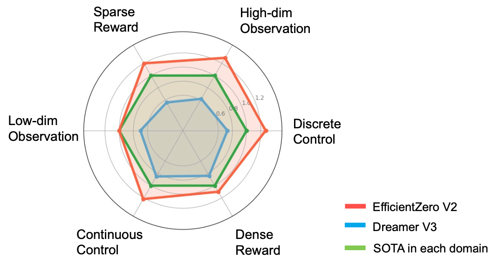
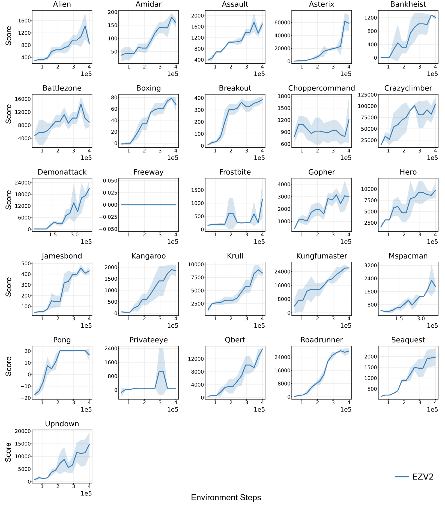
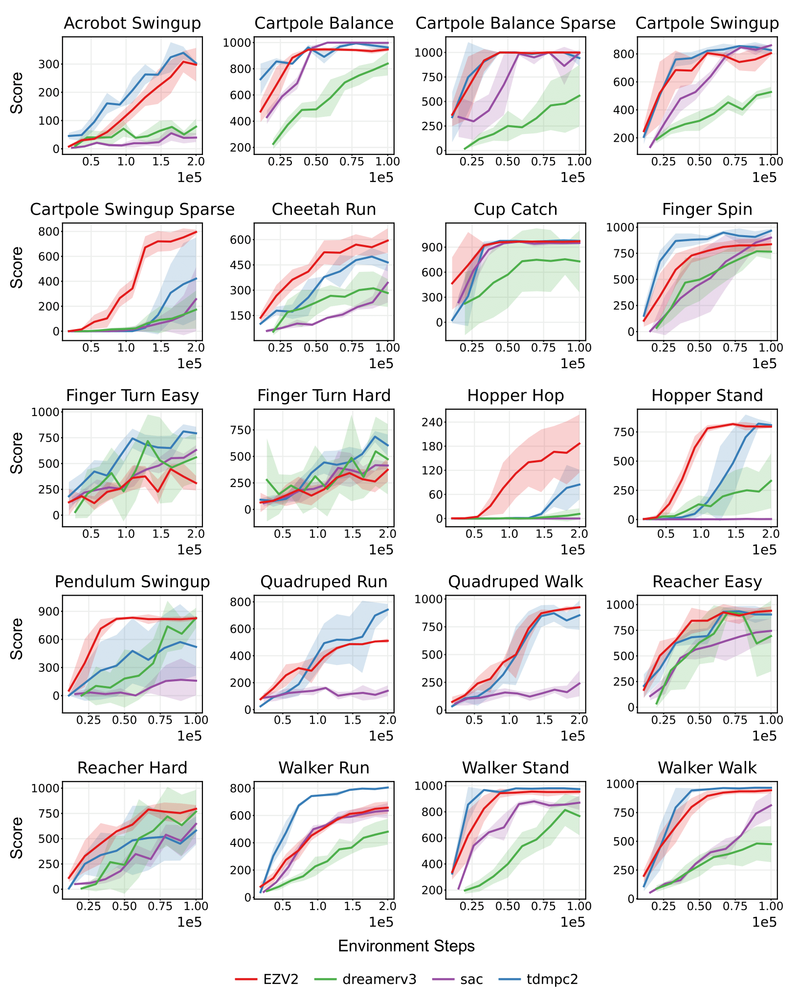
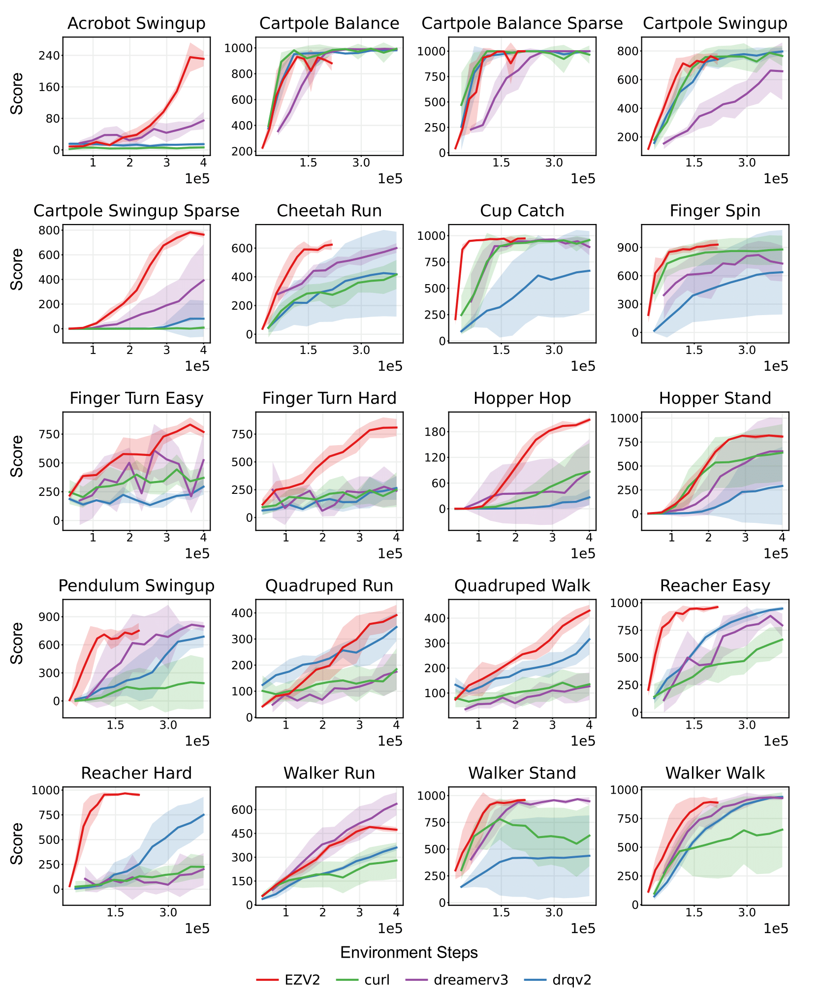

# EfficientZero V2: Mastering Discrete and Continuous Control with Limited Data

<a href="https://arxiv.org/abs/2403.00564"><strong>Project Page</strong></a>
  |
  <a href="https://arxiv.org/abs/2403.00564"><strong>arXiv</strong></a>
  |
  <a href="https://twitter.com/gao_young/status/1765680141869699534"><strong>Twitter</strong></a> 

  <a href="https://shengjiewang-jason.github.io/">Shengjie Wang*</a>, 
  <a href="https://liushaohuai5.github.io/">Shaohuai Liu*</a>, 
  <a href="https://yewr.github.io/">Weirui Ye*</a>, 
  <a href="https://github.com/YouJiacheng">Jiacheng You</a>, 
  <a href="https://people.iiis.tsinghua.edu.cn/~gaoyang/yang-gao.weebly.com/index.html">Yang Gao</a>

**International Conference on Machine Learning (ICML) 2024, Spotlight**


<div align="center">
  
</div>

**EfficientZero V2** is a general framework designed for sample-efficient RL algorithms. We have expanded the performance of EfficientZero to multiple domains, encompassing both contin- uous and discrete actions, as well as visual and low-dimensional inputs. 

EfficientZero V2 outperforms the current state-of-the-art (SOTA) by a significant margin in diverse tasks under the limited data setting. EfficientZero V2 exhibits a notable ad- vancement over the prevailing general algorithm, DreamerV3, achieving superior outcomes in **50** of **66** evaluated tasks across diverse benchmarks, such as Atari 100k, Proprio Control, and Vision Control.


## 🎉 News
- [2024-05-30] We have released the code for EfficientZero V2. 

## 💻 Installation

See [INSTALL.md](INSTALL.md) for installation instructions. 


## 🛠️ Running Experiments

Then, you can run the following command to start training:

```bash
#!/bin/bash

export OMP_NUM_THREADS=1
export CUDA_VISIBLE_DEVICES=0,1
export HYDRA_FULL_ERROR=1

# # Port for DDP
# export MASTER_PORT='12300'

# Atari
python ez/train.py exp_config=ez/config/exp/atari.yaml 
# DMC state
python ez/train.py exp_config=ez/config/exp/dmc_state.yaml
# DMC image
python ez/train.py exp_config=ez/config/exp/dmc_image.yaml
```

### More Details
<details>
We define the configuration of each domain in `ez/config/exp/{domain}.yaml`. By now, we support the domains like `atari`, `dmc_state` and `dmc_image`.
In the config file, you can modify the relevant content for your experiment, such as `game`, `training_steps` and `total_transitions`. 

Note that if you modify the variable `total_transitions`, you should modify the variables `buffer_size` together. The training time will decrease if you reduce the `training_steps` variable. Basically, when the `training_steps` variable should be equal to `total_transitions`, the performance is sufficient.

#### NOTE: The released branch is mainly tested on the DM Control benchmark. However, the performance in some Atari environments does not match the results in the paper. We are still working on resolving this discrepancy.
</details>

## Running Third-Party Experiments

1. Add a configuration file in `config/exp/your_env.yaml` and define `agent_name`, etc.

2. Implement your own agent in the `agents` directory (you can directly inherit from `base.Agent`).

3. Refer to the provided agent implementations for image/state, discrete/continuous setups to implement your own agent accordingly.

4. Run the following command:
   ```bash
   python ez/train.py exp_config=ez/config/exp/your_env.yaml
   ```

## Evaluation
Run `bash eval.sh`. You can modify the relevant content for evaluation in `config/config.yaml`.

## Experiments Results
EfficientZero V2 outperforms or be comparible to SoTA baselines in multiple domains. The results can be found in `media\img` folder.

**Atari 100k**

<details>

<div align="center">
  
</div>

</details>


**DMC State**

<details>

<div align="center">
  
</div>

</details>


**DMC Image**

<details>

<div align="center">
  
</div>

</details>


## 🏷️ License
This repository is released under the GPL license. See [LICENSE](LICENSE) for additional details.

## 😺 Acknowledgement
Our code is generally built upon: [EfficientZero](https://github.com/YeWR/EfficientZero). 
We thank all these authors for their nicely open sourced code and their great contributions to the community.

Contact [Shengjie Wang](https://shengjiewang-jason.github.io/), [Shaohuai Liu](https://liushaohuai5.github.io/) and [Weirui Ye](https://yewr.github.io/) if you have any questions or suggestions.

## 📝 Citation

If you find our work useful, please consider citing:
```
@article{wang2024efficientzero,
  title={EfficientZero V2: Mastering Discrete and Continuous Control with Limited Data},
  author={Wang, Shengjie and Liu, Shaohuai and Ye, Weirui and You, Jiacheng and Gao, Yang},
  journal={arXiv preprint arXiv:2403.00564},
  year={2024}
}
```
